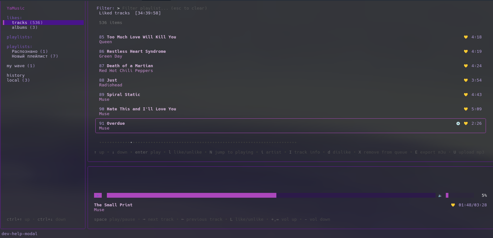

<p align="center">
  
</p>

# wellya

[](LICENSE)
[](https://goreportcard.com/report/github.com/wellbou/wellya)

A Yandex Music terminal client. Fork of [yamusic-tui](https://github.com/DECE2183/yamusic-tui) with extra features and fixes.<br>
Based on [yandex-music-open-api](https://github.com/acherkashin/yandex-music-open-api).



### Requirements

A valid Yandex Music account and an access token. The easiest way to get a token is a browser extension ([Chrome](https://chrome.google.com/webstore/detail/yandex-music-token/lcbjeookjibfhjjopieifgjnhlegmkib), [Firefox](https://addons.mozilla.org/en-US/firefox/addon/yandex-music-token/)).

### Features

- Player: play/pause, next/previous track, progress bar, rewind, volume, mute (`m`)
- Repeat modes (`r`): off / all / one. Sleep timer (`n`): 15 to 120 minutes
- Like/unlike (`l` / `L`), dislike (`d` / `D`), share link copy (`ctrl+s`)
- Synced lyrics (`t`), audio quality switch (`q`): best / high / medium / low with bitrate display
- Track caching (`S`), cache all liked tracks (`C`), download to file (`ctrl+w`)
- Tabs: Playlists, Radio (`R`), Search (`S`)
- My Wave stays in the main list; all other stations live on the Radio tab
- Listening history (last 100 tracks), play queue view (`tab`), jump to playing (`N`)
- Artist browse from track (`i`), go to album (`A`), track info (`I`)
- Remove from queue without unliking (`X`), move tracks (`ctrl+u` / `ctrl+d`)
- Sort (`s`): title / artist / duration. Inline playlist filter (`/` or just type, `esc` clears)
- Global search tab: `enter` plays now, `p` enqueues as next
- Playlist export to M3U (`E`), local file import (`U`): MP3/M3U files or folders
- Stats toast (`ctrl+g`), toast notifications, delete confirmations (`y`/`n`)
- Full hotkey reference modal (`F1`), every key rebindable in config
- Resilient API parsing: numeric and id fields tolerate Yandex returning numbers as strings and back (FlexString/FlexInt/FlexUint64)

### Installation

```bash
go install github.com/wellbou/wellya@latest
```

Or build locally:

```bash
git clone https://github.com/wellbou/wellya
cd wellya
go build -o wellya .
./wellya
```

To update: run `go install github.com/wellbou/wellya@latest` again.

### Configuration

The config file is `~/.config/wellya/config.yaml`. It is created with defaults on first run. A config from `~/.config/yamusic-tui/config.yaml` is picked up automatically if present.

```yaml
token: <your yandex music token>
buffer-size-ms: 80
rewind-duration-s: 5
volume: 0.5
volume-step: 0.05
suppress-errors: false
show-lyrics: false
audio-quality: best # best/high/medium/low
cache-tracks: likes # none/likes/all
cache-dir: ""
download-dir: "" # default: XDG music dir (~/Music or ~/Музыка)
proxy: "" # proxy URL; falls back to HTTP_PROXY and HTTPS_PROXY
search:
    artists: true
    albums: false
    playlists: false
controls:
    quit: ctrl+q,ctrl+c
    apply: enter
    cancel: esc
    cursor-up: up
    cursor-down: down
    reload: ctrl+\
    show-all-keys: ?
    keys-help: f1
    playlists-up: ctrl+up
    playlists-down: ctrl+down
    playlists-rename: ctrl+r
    playlists-hide: ctrl+b
    playlists-radio: R
    tracks-page-up: pgup
    tracks-page-down: pgdown
    tracks-like: l
    tracks-add-to-playlist: a
    tracks-remove-from-playlist: ctrl+a
    tracks-remove-from-queue: X
    tracks-export: E
    tracks-upload: U
    tracks-stats: ctrl+g
    tracks-play-next: p
    tracks-share: ctrl+s
    tracks-shuffle: ctrl+x
    tracks-search: ctrl+f
    tracks-search-tab: S
    tracks-back: backspace
    tracks-hide: ctrl+t
    tracks-move-up: ctrl+u
    tracks-move-down: ctrl+d
    tracks-jump-to-playing: N
    tracks-artist-browse: i
    tracks-show-queue: tab
    tracks-info: I
    tracks-go-to-album: A
    tracks-dislike: d
    tracks-sort: s
    tracks-filter: /
    player-pause: space
    player-next: right
    player-previous: left
    player-rewind-forward: ctrl+right
    player-rewind-backward: ctrl+left
    player-like: L
    player-cache: S
    player-vol-up: +,=
    player-vol-down: '-'
    player-toggle-lyrics: t
    player-hide: ctrl+p
    player-cache-all-liked: C
    player-download: ctrl+w
    player-quality-cycle: q
    player-mute: m
    player-repeat-mode: r
    player-sleep-timer: n
    player-dislike: D
```

Multiple keys per action are allowed, separated by commas.

Cached tracks go to the system cache directory (`~/.cache/wellya` on Linux) unless `cache-dir` is set. Increase `buffer-size-ms` if playback stutters.

### Local files

Press `U` and enter a path to an MP3/M3U file or a folder. Files are parsed for ID3 tags, copied into the cache and added to Cached tracks, ready to play. Yandex-side upload is not supported by the API, so this stays local. Use the Yandex Music website to upload tracks to your cloud library.

### System media controls


MPRIS on Linux, SMTC on Windows, MPRemoteCommandCenter on macOS. Disable by building with the `nomedia` tag:

```bash
go build -tags='nomedia' -o wellya .
```

On macOS the binary needs an external linker for the media keys to work:

```bash
go build -ldflags="-linkmode=external" -o wellya .
```

---

<p align="center">
  
  <br>
  <em>Tested on the author's favourite album — Muse, Origin of Symmetry (2001).</em>
</p>
